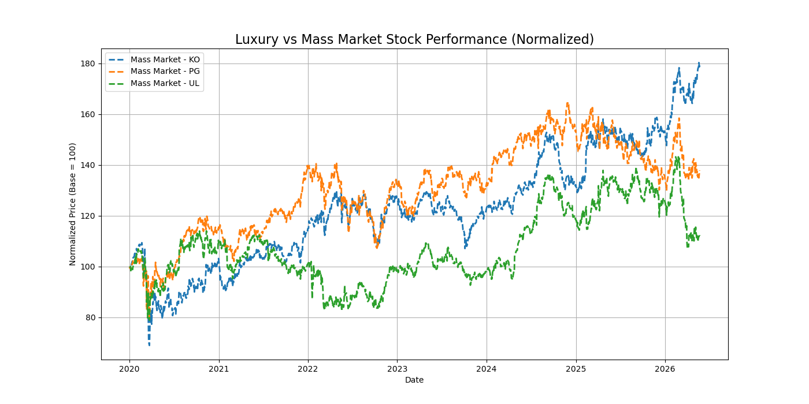
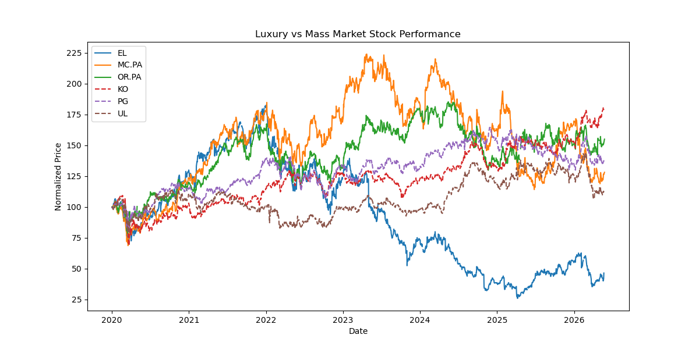
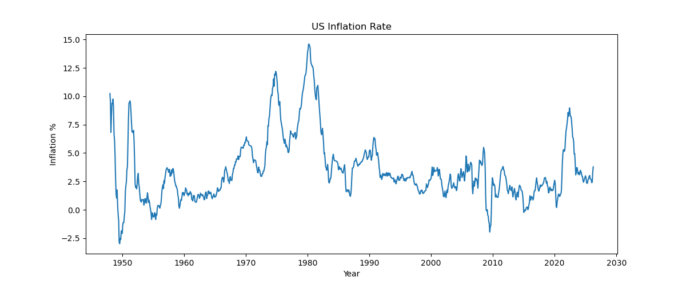
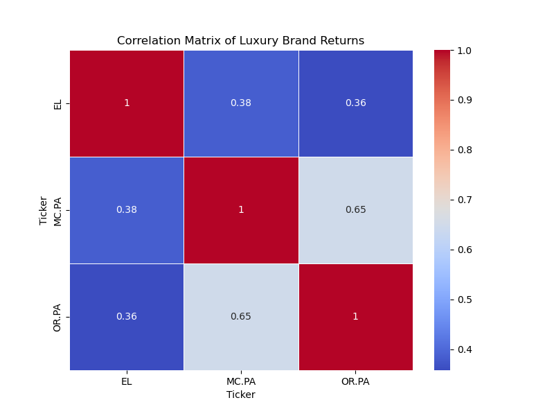
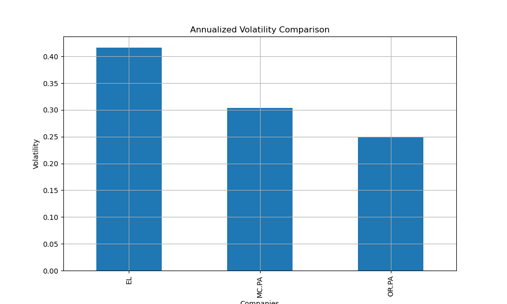

# luxury-vs-mass-market-analysisv
Analyzing how inflation impacts luxury and mass-market consumer brands using financial and macroeconomic data.Analyzing how inflation impacts luxury and mass-market consumer brands using financial and macroeconomic data.

# Luxury vs Mass Market Consumer Spending Analysis

## Overview
This project analyzes how inflation impacts luxury and mass-market consumer brands using financial and macroeconomic data.

The objective is to understand whether premium consumer brands remain resilient during inflationary periods compared to mass-market companies.

The analysis combines:
- Inflation trends
- Consumer sector stock performance
- Revenue growth trends
- Financial metrics
- Consumer behavior insights

---

## Objectives
- Compare luxury vs mass-market brand performance
- Analyze the impact of inflation on consumer spending
- Study resilience of premium brands during economic slowdowns
- Visualize financial and macroeconomic trends
- Build business and investment insights using data analytics

---

## Companies Analyzed

### Luxury / Premium Brands
- L'Oréal
- Estée Lauder
- LVMH
- Nike

### Mass Market / FMCG Brands
- Unilever
- Procter & Gamble
- Nestlé
- Coca-Cola

---

## Tools & Libraries
- Python
- pandas
- numpy
- matplotlib
- seaborn
- yfinance
- Jupyter Notebook

---

## Project Structure

```bash
luxury-vs-mass-market-analysis/
│
├── data/
├── notebooks/
├── charts/
├── reports/
├── README.md
└── requirements.txt
```

---

## Planned Analysis
- Inflation vs stock performance
- Revenue growth comparison
- Consumer spending resilience
- Volatility analysis
- Sector performance visualization
- Correlation analysis

---

## Future Improvements
- Interactive dashboard
- Forecasting models
- Consumer sentiment analysis
- ESG comparison
- Geographic revenue analysis
- ## Key Insights
# Stock Performance Analysis 
 

The normalized stock performance analysis compares the growth trajectories of major luxury consumer companies from 2020 onward.

## Key Findings

- LVMH (`MC.PA`) demonstrated the strongest overall growth and post-pandemic recovery among the analyzed companies.
- L'Oréal (`OR.PA`) showed relatively stable and consistent long-term growth throughout the period.
- Estée Lauder (`EL`) experienced comparatively weaker performance and significant decline after 2022.
- The companies displayed different recovery patterns despite operating within the broader luxury and premium consumer sector.

## Business Interpretation

The results suggest that premium consumer companies respond differently to inflationary conditions and changing consumer sentiment.

LVMH’s strong performance may indicate:
- Strong global luxury demand
- Effective brand positioning
- Greater pricing power during inflationary periods

L'Oréal’s comparatively stable growth suggests:
- Defensive characteristics within the beauty industry
- Consistent consumer demand
- Strong operational resilience

Estée Lauder’s weaker performance may reflect:
- Market-specific operational challenges
- Shifts in premium beauty demand
- Increased investor uncertainty

## Economic Interpretation

The findings support the idea that higher-income consumer segments may remain relatively resilient during periods of inflation and economic uncertainty.

Luxury-oriented firms with strong brand value may possess greater ability to transfer rising costs to consumers without significantly reducing demand.

---

## Stock Performance Chart

 

---

# Inflation Trend Analysis

US inflation trends were analyzed using Consumer Price Index (CPI) data obtained from FRED (Federal Reserve Economic Data).

## Key Findings

- Inflation increased sharply during the post-pandemic recovery period, reaching elevated levels not observed in recent decades.
- Inflation volatility was particularly high during periods of economic disruption and supply chain instability.
- Consumer-oriented companies experienced varying levels of sensitivity to inflationary pressures.

## Business Interpretation

Periods of elevated inflation can significantly influence:
- Consumer purchasing behavior
- Corporate pricing strategies
- Profit margins
- Investor sentiment

Luxury brands appeared relatively more resilient during inflationary periods due to stronger pricing flexibility and premium consumer demand.

Mass-market firms may face greater pressure from rising input costs and price-sensitive consumer behavior.

## Economic Interpretation

The inflation trend highlights the broader macroeconomic environment affecting consumer industries during the analysis period.

The data suggests that inflation does not affect all consumer sectors equally, with premium and luxury firms potentially benefiting from stronger consumer loyalty and pricing power.

---

## Inflation Trend Chart



---

# Correlation Matrix Analysis

The correlation matrix evaluates how closely the stock returns of luxury consumer companies moved together during the analysis period.

## Key Findings

- LVMH (`MC.PA`) and L'Oréal (`OR.PA`) showed the strongest positive correlation (0.65), indicating relatively similar stock movement patterns over time.
- Estée Lauder (`EL`) demonstrated weaker correlations with the other luxury firms (0.36–0.38), suggesting more company-specific performance dynamics.
- The results indicate that luxury consumer firms do not react identically to macroeconomic conditions and investor sentiment.

## Business Interpretation

The stronger relationship between LVMH and L'Oréal may reflect:
- Similar exposure to global luxury consumption trends
- Strong international market presence
- Comparable sensitivity to premium consumer spending behavior

The lower correlation observed for Estée Lauder may indicate:
- Different operational performance trends
- Variations in geographic market exposure
- Distinct post-pandemic recovery patterns
- Company-specific business challenges

Overall, the analysis highlights that stock performance within the luxury consumer sector is influenced by both shared industry trends and firm-specific factors.

---

## Correlation Matrix Heatmap



---

# Volatility Analysis

Annualized volatility was used to measure the relative level of risk and stock price fluctuation for each luxury company.

## Key Findings

- Estée Lauder (`EL`) recorded the highest annualized volatility, indicating the largest price fluctuations and highest relative risk among the analyzed firms.
- LVMH (`MC.PA`) displayed moderate volatility while maintaining strong overall growth performance.
- L'Oréal (`OR.PA`) exhibited the lowest volatility, suggesting comparatively greater stock price stability.

## Business Interpretation

Higher volatility in Estée Lauder may reflect:
- Greater sensitivity to investor sentiment
- Operational uncertainties
- Shifts in consumer demand patterns
- Increased exposure to market uncertainty during inflationary periods

L'Oréal’s lower volatility suggests:
- Stronger business stability
- More resilient consumer demand
- Effective pricing power
- Defensive characteristics within the premium beauty sector

LVMH demonstrated a balance between strong growth potential and relatively manageable risk levels.

## Economic Interpretation

The results suggest that luxury consumer companies experience varying degrees of sensitivity to inflation and macroeconomic uncertainty.

Companies with stronger brand positioning and diversified global operations may be better equipped to maintain stability during periods of elevated inflation and changing consumer spending behavior.

---

## Volatility Comparison Chart


### Luxury Brand Resilience
Luxury-oriented companies such as LVMH and L'Oréal demonstrated stronger long-term growth and recovery patterns compared to several mass-market firms during inflationary periods.

### Pricing Power Advantage
Premium brands appeared more capable of transferring higher costs to consumers without significantly affecting demand, indicating stronger pricing power.

### Correlation Trends
LVMH and L'Oréal displayed relatively stronger correlations, suggesting similar exposure to global luxury consumption trends. Estée Lauder showed weaker correlations, indicating different market dynamics and company-specific performance factors.

### Economic Implication
The findings suggest that higher-income consumer segments may remain relatively resilient during inflationary periods, supporting the idea that luxury demand can be less price-sensitive.

---

## Author
Gopika Thalavai Nallasivan
BSc Economics  | CFA Level I Candidate
